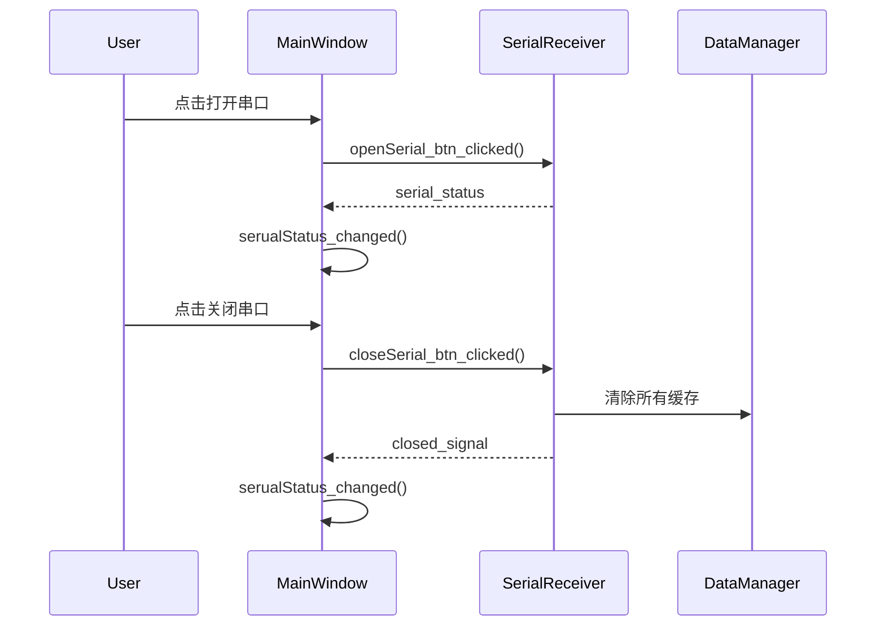
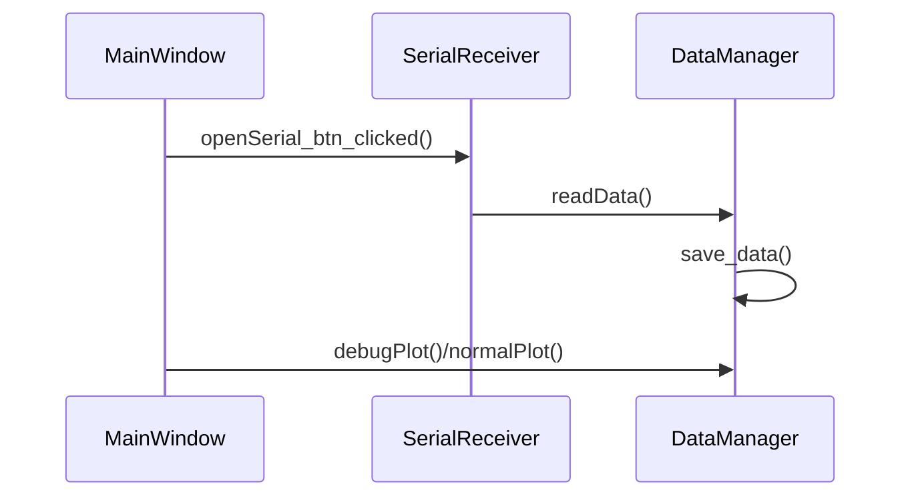

# 项目信号与槽使用分析

## 串口状态切换示意图

```mermaid
sequenceDiagram

    participant User
    participant UI as MainWindow
    participant SR as SerialReceiver
    participant DM as DataManager

    User->>UI:点击打开串口
    UI->>SR:openSerial_btn_clicked()
    SR-->>UI:serial_status
    UI->>UI:serualStatus_changed()
    User->>UI:点击关闭串口
    UI->>SR:closeSerial_btn_clicked()
    SR->>DM:清除所有缓存
    SR-->>UI:closed_signal
    UI->>UI:serualStatus_changed()
```

## 数据处理流程示意图

```mermaid
sequenceDiagram

    participant UI as MainWindow
    participant SR as SerialReceiver
    participant DM as DataManager

    UI->>SR:openSerial_btn_clicked()
    SR->>DM:readData()
    DM->>DM:save_data()
    UI->>DM:debugPlot()/normalPlot()
```